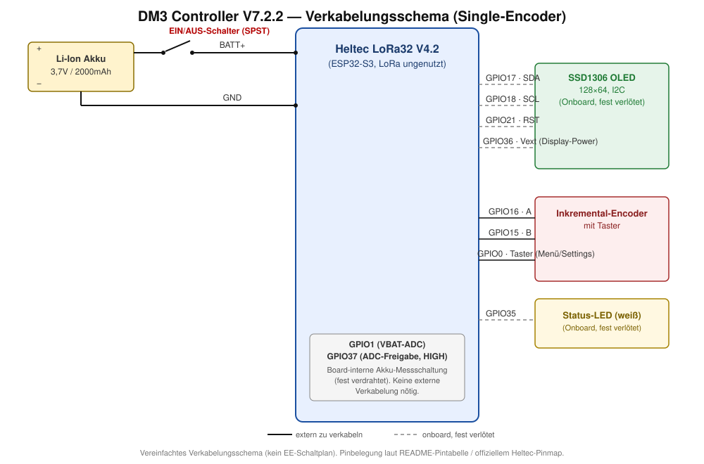

# DM3 Controller V7.2.3 — Single-Encoder-Hardware

Firmware für die ursprüngliche Hardware-Variante mit **einem** Drehencoder und dem Heltec-Onboard-OLED. Allgemeine Projektbeschreibung, DM3-Protokoll und Software-Funktionsliste stehen im [Haupt-README](../README.md).

Die Änderungen wurden 1:1 von [V7.3.1_DualEncoder](../DM3_Controller_V7.3.1_DualEncoder/) übernommen (die dortigen Fixes wurden wiederum von V7.6_DualEncoder_TripleDisplay portiert, wo sie live gegen ein echtes DM3 entwickelt/verifiziert wurden).

**Neu in V7.2.3**: kompletter DM3-Netzwerkverkehr (Verbindung, Senden, Empfangen, Polling) läuft jetzt in einem eigenen FreeRTOS-Task statt in `loop()` — ein blockierendes `dm3.print()`/`dm3.read()` (laut ESP32-Core-Quelle im schlechtesten Fall mehrere Sekunden) konnte vorher die komplette Bedienung einfrieren lassen. Dazu: Fix für einen Poll-Overlap-Bug in der Latenzmessung, Latenzanzeige zeigt jetzt den letzten gemessenen Wert statt einen träge nachziehenden Mittelwert, einmalige AP-Auswahl beim Boot anhand echter TCP-Connect-Zeit zum DM3 (nicht nur Signalstärke) plus periodisches RSSI-Roaming als Fallback. Diese Portierung wurde **nur kompiliert, nicht auf echter V7.2.3-Hardware verifiziert** — vor Produktiveinsatz auf dieser Hardware-Variante testen.

## Funktionsprinzip

- **Gespeicherte WLAN-Profile** (SETTINGS → WIFI): bis zu 5 Netzwerke (Name, SSID, Passwort) speicherbar — NEW legt eins an und verbindet sofort, SAVED verbindet mit einem bestehenden Profil oder öffnet EDIT (NAME/SSID/PASSWORD/DELETE/BACK).
- **Web-Konfigurationsserver** (SETTINGS → WEB CONFIG): alle Einstellungen (WLAN-Profile, DM3-IP, Kanal-Slots, Schrittweite, Ruhezustand-Zeit) auch per Browser erreichbar. SERVER: ON/OFF aktiviert den Server im normalen WLAN-Betrieb; findet der Controller 20s lang kein WLAN, baut er automatisch einen eigenen AP auf (`DM3-Setup-XXXX`, änderbares WPA2-Passwort, Default `dm3setup1`) — die Weboberfläche ist dann unter `http://192.168.4.1/` erreichbar, auch ganz ohne vorhandenes Netzwerk. Gespeicherte Passwörter stehen im Browser standardmäßig maskiert (Punkte) mit "Anzeigen"-Knopf pro Feld.
- Web-Symbol (kleiner Globus) direkt vor dem Akku-Symbol, wenn der Web-Konfigurationsserver gerade erreichbar ist.
- Ist der AP-Fallback aktiv, zeigt der MASTER-Screen statt "WAIT DM3"/"DM3 OFFLINE" die AP-IP (`AP: 192.168.4.1`) — das einzige Display hat anders als bei V7.3.1 keine separate Statuszeile, daher ersetzt die AP-Info hier direkt die DM3-Statuszeile. Aus demselben Platzgrund steht die zuletzt gemessene DM3-Antwortzeit hier nicht auf dem Display, sondern nur auf der WEB CONFIG-Seite und im Browser.

## Hardware

- Heltec LoRa32 V4.2 (ESP32-S3, LoRa-Funktion ungenutzt)
- Onboard-SSD1306-OLED (128×64, I2C, fest verlötet)
- 1x Inkremental-Drehencoder mit Taster
- Akku: 1S Li-Ion 103450, 3,7 V, 2000 mAh / 7,4 Wh

### Pinbelegung

| Funktion   | Pin |
|------------|-----|
| OLED SDA   | 17  |
| OLED SCL   | 18  |
| OLED RST   | 21  |
| Vext (Display-Power) | 36 |
| Encoder A  | 16  |
| Encoder B  | 15  |
| Encoder-Taster | 0 |
| Akku-ADC (VBAT) | 1 |
| Akku-ADC Freigabe (aktiv HIGH) | 37 |
| Status-LED (weiß) | 35 |

## Flashen

1. Diesen Ordner in der Arduino IDE öffnen (die `.ino`-Datei liegt im gleichnamigen Ordner)
2. Board auf Heltec LoRa32 V4.2 (bzw. passendes ESP32-S3-Board) einstellen
3. Benötigte Bibliotheken über den Bibliotheksverwalter installieren (siehe Haupt-README)
4. WLAN- und DM3-Konfiguration in der `.ino`-Datei anpassen (`wifiSSID`/`wifiPassword`/`dm3IP`) — zusätzlich direkt am Gerät über SETTINGS änderbar
5. **„USB CDC On Boot" auf „Enabled" stellen** – ohne diese Option bleibt die serielle Debug-Ausgabe über den USB-Port unsichtbar
6. Hochladen

Der Vorgänger [DM3_Controller_V7.2.2_SingleEncoder/](../archive/DM3_Controller_V7.2.2_SingleEncoder/) (und [DM3_Controller_V7.2.1_SingleEncoder/](../archive/DM3_Controller_V7.2.1_SingleEncoder/) davor, plus die NoDebug-Variante) ist archiviert.
