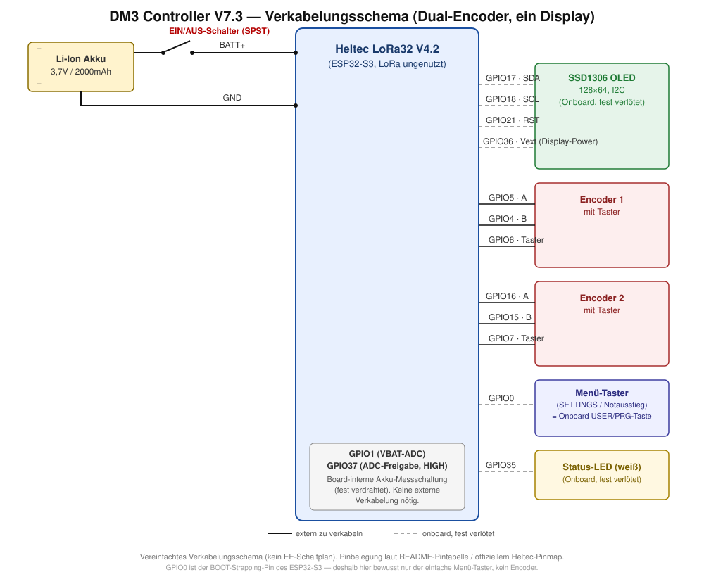

# DM3 Controller V7.3.1 — Dual-Encoder-Hardware (ein Display)

Firmware für die Hardware-Revision mit **zwei** unabhängigen Drehencodern (zwei Kanäle gleichzeitig steuerbar), aber noch mit dem einen Heltec-Onboard-OLED (vertikal geteilt: Encoder 1 links, Encoder 2 rechts). Läuft **nicht** auf der Single-Encoder-Hardware — siehe [DM3_Controller_V7.2.2_SingleEncoder/](../DM3_Controller_V7.2.2_SingleEncoder/) dafür. Für die Variante mit zwei physisch getrennten Displays siehe [DM3_Controller_V7.4_DualEncoder_DualDisplay/](../DM3_Controller_V7.4_DualEncoder_DualDisplay/).

**Neu in V7.3.1** (portiert von V7.6_DualEncoder_TripleDisplay, wo diese Fixes live gegen ein echtes DM3 entwickelt/verifiziert wurden): kompletter DM3-Netzwerkverkehr (Verbindung, Senden, Empfangen, Polling) läuft jetzt in einem eigenen FreeRTOS-Task statt in `loop()` — ein blockierendes `dm3.print()`/`dm3.read()` (laut ESP32-Core-Quelle im schlechtesten Fall mehrere Sekunden) konnte vorher die komplette Bedienung einfrieren lassen. Dazu: Fix für einen Poll-Overlap-Bug in der Latenzmessung, Latenzanzeige zeigt jetzt den letzten gemessenen Wert statt einen träge nachziehenden Mittelwert, einmalige AP-Auswahl beim Boot anhand echter TCP-Connect-Zeit zum DM3 (nicht nur Signalstärke) plus periodisches RSSI-Roaming als Fallback. Diese Portierung wurde **nur kompiliert, nicht auf echter V7.3.1-Hardware verifiziert** — vor Produktiveinsatz auf dieser Hardware-Variante testen.

Allgemeine Projektbeschreibung, DM3-Protokoll und die volle Software-Funktionsliste stehen im [Haupt-README](../README.md).

## Funktionsprinzip

- Encoder 1 und Encoder 2 zeigen/steuern **gleichzeitig zwei unabhängige Kanäle** (`activeSlot1`/`activeSlot2`), nie denselben Kanal doppelt (automatisches Überspringen beim Kanalwechsel).
- Nur Encoder 1 bedient das komplette SETTINGS-Menü; Encoder 2 bleibt davon unberührt und steuert immer nur seinen eigenen Kanal (Drehen = Pegel, kurzer Tasterdruck = Mute, langer Druck = Kanal wechseln mit Wraparound über ST Master).
- Ein dedizierter Menü-Taster (GPIO0) öffnet SETTINGS; langer Druck darauf ist ein Notausstieg aus jedem Untermenü zurück zu MASTER.
- Das Display ist vertikal geteilt: Kanal 1 links, Kanal 2 rechts, mit Trennlinie. Ein Kanalname, der (inkl. „MUTE"-Zusatz) nicht in seine halbe Spaltenbreite passt, läuft automatisch durch (scrollt).
- Statuszeile unten (scrollt bei Bedarf durch): zeigt je nach Zustand AP-Fallback-Info, DM3-Verbindungsstatus (WAIT/OFFLINE) oder — sobald DM3 verbunden ist — die zuletzt gemessene DM3-Antwortzeit in ms.
- Web-Symbol (kleiner Globus) direkt vor dem Akku-Symbol, wenn der Web-Konfigurationsserver gerade erreichbar ist.
- **Gespeicherte WLAN-Profile** (SETTINGS → WIFI): bis zu 5 Netzwerke (Name, SSID, Passwort) speicherbar — NEW legt eins an und verbindet sofort, SAVED verbindet mit einem bestehenden Profil oder öffnet EDIT (NAME/SSID/PASSWORD/DELETE/BACK).
- **Web-Konfigurationsserver** (SETTINGS → WEB CONFIG): alle Einstellungen (WLAN-Profile, DM3-IP, Kanal-Slots, Schrittweite, Ruhezustand-Zeit) auch per Browser erreichbar. SERVER: ON/OFF aktiviert den Server im normalen WLAN-Betrieb; findet der Controller 20s lang kein WLAN, baut er automatisch einen eigenen AP auf (`DM3-Setup-XXXX`, änderbares WPA2-Passwort, Default `dm3setup1`) — die Weboberfläche ist dann unter `http://192.168.4.1/` erreichbar, auch ganz ohne vorhandenes Netzwerk. Gespeicherte Passwörter stehen im Browser standardmäßig maskiert (Punkte) mit "Anzeigen"-Knopf pro Feld.

## Hardware

- Heltec LoRa32 V4.2 (ESP32-S3, LoRa-Funktion ungenutzt)
- Onboard-SSD1306-OLED (128×64, I2C, fest verlötet)
- 2x Inkremental-Drehencoder mit Taster
- Menü-Taster: kein zusätzliches Bauteil — nutzt die vorhandene Onboard-USER/PRG-Taste des Boards
- Akku: 1S Li-Ion 103450, 3,7 V, 2000 mAh / 7,4 Wh

### Pinbelegung

| Funktion   | Pin |
|------------|-----|
| OLED SDA   | 17  |
| OLED SCL   | 18  |
| OLED RST   | 21  |
| Vext (Display-Power) | 36 |
| Encoder 1 A | 5 |
| Encoder 1 B | 4 |
| Encoder 1 Taster | 6 |
| Encoder 2 A | 16 |
| Encoder 2 B | 15 |
| Encoder 2 Taster | 7 |
| Menü-Taster (SETTINGS öffnen / Notausstieg) | 0 |
| Akku-ADC (VBAT) | 1 |
| Akku-ADC Freigabe (aktiv HIGH) | 37 |
| Status-LED (weiß) | 35 |

> GPIO0 ist beim ESP32-S3 der BOOT-Strapping-Pin; ein daran hängender Taster könnte beim Einschalten ungewollt den Bootloader auslösen, wenn er zu diesem Zeitpunkt gedrückt gehalten wird. Deshalb ist GPIO0 hier bewusst nur dem einfachen Menü-Taster vorbehalten und nicht mehr fest mit einem Encoder verdrahtet (anders als bei der Single-Encoder-Hardware). Praktischerweise hängt an GPIO0 auf dem Heltec-Board ohnehin schon die eingebaute USER/PRG-Taste — der Menü-Taster braucht also kein zusätzliches, extern angelötetes Bauteil.

## Flashen

1. Diesen Ordner in der Arduino IDE öffnen (die `.ino`-Datei liegt im gleichnamigen Ordner)
2. Board auf Heltec LoRa32 V4.2 (bzw. passendes ESP32-S3-Board) einstellen
3. Benötigte Bibliotheken über den Bibliotheksverwalter installieren (siehe Haupt-README)
4. WLAN- und DM3-Konfiguration in der `.ino`-Datei anpassen (`wifiSSID`/`wifiPassword`/`dm3IP`) — zusätzlich direkt am Gerät über SETTINGS änderbar
5. **„USB CDC On Boot" auf „Enabled" stellen** – ohne diese Option bleibt die serielle Debug-Ausgabe über den USB-Port unsichtbar
6. Hochladen

Der Vorgänger [DM3_Controller_V7.3_DualEncoder/](../archive/DM3_Controller_V7.3_DualEncoder/) ist archiviert.
