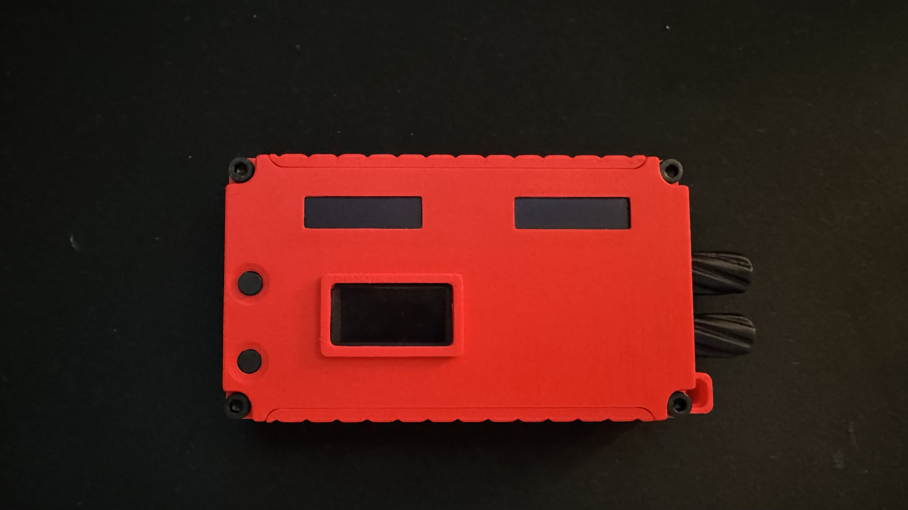
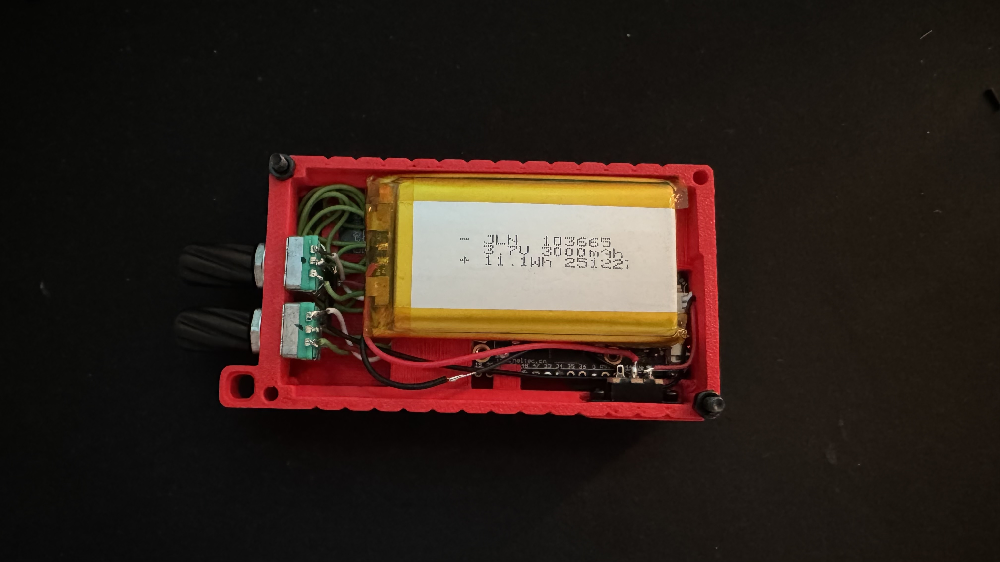

# DM3 Controller V7.5 — Dual-Encoder + Triple-Display-Hardware

Firmware für die Hardware-Revision mit **zwei** unabhängigen Drehencodern und **drei** Displays: zwei physisch getrennte 128×32-SSD1306-Displays (ein Display pro Kanal, wie in [V7.4](../DM3_Controller_V7.4_DualEncoder_DualDisplay/)) PLUS das Heltec-Onboard-OLED (128×64), das jetzt als dediziertes Menü-/SETTINGS-Display genutzt wird statt ungenutzt zu bleiben.

Läuft **nicht** auf der Single-Encoder-Hardware ([DM3_Controller_V7.2.1_SingleEncoder/](../DM3_Controller_V7.2.1_SingleEncoder/)), **nicht** auf der Dual-Encoder-Hardware mit nur einem OLED ([DM3_Controller_V7.3_DualEncoder/](../DM3_Controller_V7.3_DualEncoder/)) und **nicht** auf der Dual-Display-Hardware ohne genutztes Onboard-OLED ([archive/DM3_Controller_V7.4_DualEncoder_DualDisplay/](../archive/DM3_Controller_V7.4_DualEncoder_DualDisplay/)).

Allgemeine Projektbeschreibung, DM3-Protokoll und die volle Software-Funktionsliste stehen im [Haupt-README](../README.md).

| Vorderseite | Rückseite (offen) |
|---|---|
|  |  |

## Funktionsprinzip

- **Display 1** (Onboard-OLED, 128×64): dediziertes Menü-Display. Zeigt außerhalb eines geöffneten Untermenüs ein Status-Dashboard (WLAN-IP, DM3-Verbindungsstatus, Akku). Öffnet sich per Menü-Taster (GPIO0), nur Encoder 1 navigiert darin. Im Ruhezustand zeigt es "SLEEP".
  - Ist DM3 verbunden, steht hinter "DM3: CONNECTED" zusätzlich die durchschnittliche Antwortzeit in ms (laufender Mittelwert über alle Poll-Zyklen seit dem letzten Boot). Erscheint auch auf der Web-Status-Seite (`/`).
- **Display 2** (links, 128×32) und **Display 3** (rechts, 128×32): zeigen **immer** Kanal 1 bzw. Kanal 2, unabhängig vom Menüzustand auf Display 1. Kein Verbindungsstatus-Text hier (steht nur auf Display 1) — im Ruhezustand bleiben beide einfach leer/dunkel.
- Kanalname scrollt automatisch durch, wenn er (inkl. "MUTE"-Zusatz) nicht in die Displaybreite passt.
- Langer Druck auf einem Encoder-Taster wechselt nur den eigenen Kanal (Wraparound über ST Master, überspringt automatisch den vom jeweils anderen Encoder belegten Kanal).
- Frei belegbare Kanal-Slots: 6× Input, 4× Mix, 2× Matrix (in SETTINGS → CHANNELS einzeln aktivierbar/deaktivierbar und auf einen beliebigen DM3-Kanal einstellbar), vorbelegt mit den durchnummerierten Standardkanälen 1..6 / 1..4 / 1..2.
- **Gespeicherte WLAN-Profile** (SETTINGS → WIFI): bis zu 5 Netzwerke (Name, SSID, Passwort) speicherbar, um schnell zwischen Locations zu wechseln.
  - **NEW**: legt ein neues Profil an (Name → SSID → Passwort nacheinander eingeben), verbindet danach sofort damit und springt zurück zum Hauptbildschirm. Ohne SSID wird nichts gespeichert; Name und Passwort dürfen leer bleiben (Name fällt dann in Listen auf die SSID zurück, leeres Passwort = offenes Netz).
  - **SAVED**: Liste aller gespeicherten Profile — kurzer Druck auf ein Profil verbindet sofort damit. Am Ende der Liste: **EDIT** (öffnet dieselbe Liste, aber kurzer Druck auf ein Profil öffnet dort EDIT NAME/EDIT SSID/EDIT PASSWORD/DELETE/BACK statt zu verbinden) und **BACK**.
- **Web-Konfigurationsserver** (SETTINGS → WEB CONFIG): sämtliche Einstellungen (WLAN-Profile, DM3-IP, Kanal-Slots, Schrittweite, Ruhezustand-Zeit) sind zusätzlich per Browser erreichbar, nicht nur über die Displays/Encoder.
  - **SERVER: ON/OFF**: aktiviert/deaktiviert den Webserver im normalen WLAN-Betrieb (Toggle, persistiert). Läuft dann auf `http://<Geräte-IP>/` (IP steht im Hauptbildschirm/SETTINGS → WEB CONFIG). Läuft der Server gerade, erscheint im Hauptbildschirm ein kleines Globus-Symbol direkt hinter der IP.
  - **AP-Fallback**: findet der Controller 20s lang keine WLAN-Verbindung (egal ob wegen falschem Passwort, nicht erreichbarem Netz oder komplett fehlender Konfiguration — es muss vorher kein Profil gespeichert gewesen sein), baut er automatisch einen eigenen Access Point auf (SSID `DM3-Setup-XXXX`, geräteindividuell aus der Chip-MAC) — darüber ist die Weboberfläche unter `http://192.168.4.1/` erreichbar, auch ganz ohne vorhandenes Netzwerk. Sobald wieder eine WLAN-Verbindung klappt, schaltet sich der AP automatisch wieder ab. Solange der AP-Fallback aktiv ist, ersetzt "APMODE: 192.168.4.1" die "WIFI: ..."-Zeile im Hauptbildschirm.
  - **AP PASSWORD**: das AP-WPA2-Passwort (Default `dm3setup1`, min. 8 Zeichen) ist über SETTINGS → WEB CONFIG → AP PASSWORD am Gerät und über die Weboberfläche (`/webconfig`) änderbar.
  - Über den Browser konfigurierbar: WLAN-Profile anlegen/bearbeiten/löschen/verbinden (`/wifi`), DM3-IP (`/dm3`), Kanal-Slots aktivieren/deaktivieren und belegen (`/channels`), Schrittweite und Ruhezustand-Zeit (`/settings`), Server-Freigabe und AP-Passwort (`/webconfig`).
  - Passwortfelder (WLAN-Profile, AP-Passwort) stehen standardmäßig maskiert da (Punkte statt Klartext) und lassen sich über einen "Anzeigen"-Knopf pro Feld einblenden.

## Hardware

- Heltec LoRa32 V4.2 (ESP32-S3, LoRa-Funktion ungenutzt)
- Onboard-SSD1306-OLED (128×64, I2C, fest verlötet) — jetzt aktiv genutzt
- 2x zusätzliches SSD1306-OLED, 128×32, I2C
- 2x Inkremental-Drehencoder mit Taster
- Menü-Taster: kein zusätzliches Bauteil — nutzt die vorhandene Onboard-USER/PRG-Taste des Boards
- Akku: 1S Li-Ion 103665, 3,7 V, 3000 mAh / 11,1 Wh

### Pinbelegung

| Funktion | Pin |
|---|---|
| Onboard-OLED SDA | 17 |
| Onboard-OLED SCL | 18 |
| Onboard-OLED RST | 21 |
| Vext (Onboard-OLED-Power) | 36 |
| Encoder 1 A | 4 |
| Encoder 1 B | 5 |
| Encoder 1 Taster | 6 |
| Encoder 2 A | 15 |
| Encoder 2 B | 16 |
| Encoder 2 Taster | 7 |
| Menü-Taster (SETTINGS öffnen / Notausstieg) | 0 |
| Display 2 SDA | 34 |
| Display 2 SCL | 38 |
| Display 3 SDA | 39 |
| Display 3 SCL | 40 |
| Display 2+3 VCC | direkt 3.3V (kein GPIO) |
| Display 2+3 GND | GND |
| Akku-ADC (VBAT) | 1 |
| Akku-ADC Freigabe (aktiv HIGH) | 37 |
| Status-LED (weiß) | 35 |

**Warum zwei eigene I2C-Busse für Display 2+3 statt einem gemeinsamen?** Beide Module haben dieselbe feste I2C-Adresse (nicht per Jumper änderbar) und könnten sich daher keinen gemeinsamen Bus teilen. Jedes bekommt deshalb sein eigenes, per Software gebitbangtes SDA/SCL-Paar.

**Wichtige Performance-Anmerkung:** Software-I2C ist auf diesem Board sehr langsam (~280ms pro Frame und Display, gemessen — `setBusClock()` ändert daran nichts). Bei drei Displays, die alle in `loop()` aktualisiert würden, blockiert das lange genug, dass kurze Tastendrücke (Menü-Taster, Mute) komplett verschluckt werden. Fix: alle drei Displays werden in einem eigenen FreeRTOS-Task auf dem zweiten CPU-Kern (Core 0) aktualisiert, komplett getrennt von `loop()` (Core 1), das dadurch immer sofort auf Encoder/Taster reagiert. Alle Display-Objekt-Zugriffe (inkl. `setContrast()` für den Ruhezustand) laufen bewusst ausschließlich in diesem einen Task, um gleichzeitige I2C-Bus-Zugriffe von zwei Kernen zu vermeiden.

**GPIO34/38/39/40 als Display-Pins:** diese sind in Heltecs Dokumentation für andere Board-Varianten teils als „reserviert für Flash/SubSPI" bzw. „optionales JTAG" gelistet, funktionieren auf diesem konkreten V4.2-Board aber nachweislich als normale GPIOs (wie bereits 35/36/37 für LED/Vext/Akku).

## Flashen

1. Diesen Ordner in der Arduino IDE öffnen (die `.ino`-Datei liegt im gleichnamigen Ordner)
2. Board auf Heltec LoRa32 V4.2 (bzw. passendes ESP32-S3-Board) einstellen
3. Benötigte Bibliotheken über den Bibliotheksverwalter installieren (siehe Haupt-README)
4. WLAN- und DM3-Konfiguration in der `.ino`-Datei anpassen (`wifiSSID`/`wifiPassword`/`dm3IP`) — zusätzlich direkt am Gerät über SETTINGS änderbar
5. **„USB CDC On Boot" auf „Enabled" stellen** – ohne diese Option bleibt die serielle Debug-Ausgabe über den USB-Port unsichtbar
6. Hochladen
