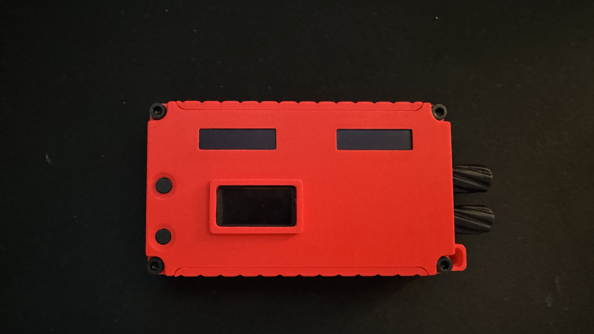
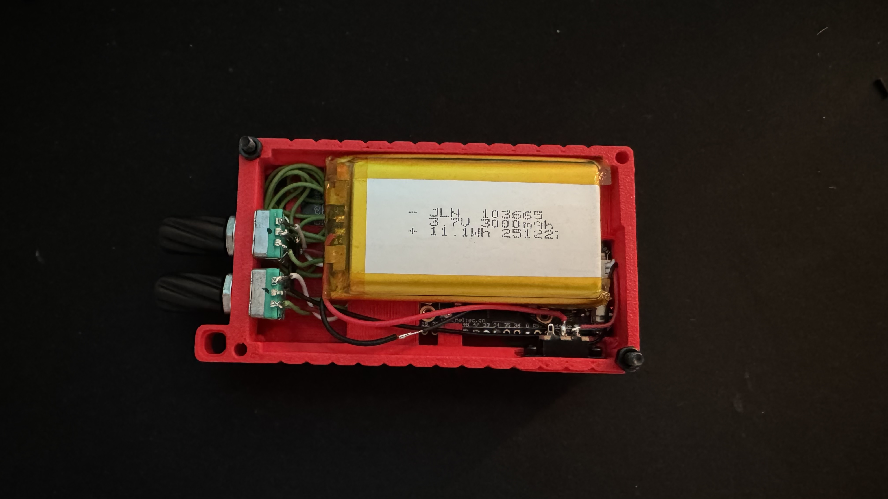

# DM3 Controller

Fernbedienung für ein Yamaha DM3 Mischpult, gebaut auf einem **Heltec LoRa32 V4.2** (ESP32-S3-basiert). Steuerung erfolgt über Drehencoder mit Taster, aktuelle Werte werden auf OLED-Display(s) angezeigt. Die Kommunikation mit dem DM3 läuft über TCP (Yamaha RCP – Remote Control Protocol) im lokalen WLAN.

Die LoRa-Funktion des Boards wird von diesem Projekt nicht verwendet.

| Vorderseite | Rückseite (offen) |
|---|---|
|  |  |

*Aktuellste Hardware-Ausbaustufe (V7.5, zwei Encoder + drei Displays) — siehe [Hardware-Varianten](#hardware-varianten) für die anderen Ausbaustufen.*

## Hardware-Varianten

Basis für alle Varianten ist ein Heltec LoRa32 V4.2 (ESP32-S3, LoRa-Funktion ungenutzt), Akku 1S Li-Ion (3,7 V). Es gibt drei parallel gepflegte Hardware-Ausbaustufen mit jeweils eigener Firmware und eigener Pinbelegung — keine davon wird durch eine andere abgelöst. Details (Pinbelegung, Bedienkonzept, Flash-Anleitung) stehen im README des jeweiligen Ordners.

| Hardware | Encoder | Displays | Firmware | Fertiges Firmware-Image |
|---|---|---|---|---|
| Einsteiger-Ausbaustufe | 1 | Onboard-OLED (128×64) | [DM3_Controller_V7.2.2_SingleEncoder/](DM3_Controller_V7.2.2_SingleEncoder/README.md) | [Release v7.2.2-singleencoder](https://github.com/LucaDBellini/DM3-Controller-Live/releases/tag/v7.2.2-singleencoder) |
| Zwei-Kanal-Ausbaustufe | 2 (unabhängig) | Onboard-OLED (128×64, geteilt) | [DM3_Controller_V7.3_DualEncoder/](DM3_Controller_V7.3_DualEncoder/README.md) | [Release v7.3-dualencoder](https://github.com/LucaDBellini/DM3-Controller-Live/releases/tag/v7.3-dualencoder) |
| Vollausbau | 2 (unabhängig) | 2× eigenständiges 128×32 + Onboard-OLED als Menü-Display | [DM3_Controller_V7.5_DualEncoder_TripleDisplay/](DM3_Controller_V7.5_DualEncoder_TripleDisplay/README.md) | [Release v7.5-dualencoder-tripledisplay](https://github.com/LucaDBellini/DM3-Controller-Live/releases/tag/v7.5-dualencoder-tripledisplay) |

Alle drei Firmware-Versionen teilen sich denselben Funktionskern (Kanalsteuerung, WLAN-Profile, Web-Konfigurationsserver, DM3-Protokoll) — Bedienkonzept und Display-Layout unterscheiden sich je nach Hardware. Details siehe jeweiliges Ordner-README.

Wer nicht selbst mit der Arduino IDE kompilieren will: die Spalte "Fertiges Firmware-Image" verlinkt auf ein GitHub Release mit einem fertigen `.bin` pro Hardware-Variante — ein einziger `esptool`-Befehl (oder ein Browser-Flash-Tool wie [ESP Web Tools](https://esphome.github.io/esp-web-tools/)) reicht zum Flashen, siehe die jeweilige Release-Beschreibung für den genauen Befehl.

## Funktionen

### Kanalsteuerung
- Mute/Volume für ST Master (immer verfügbar) plus frei wählbare DM3-Kanäle: Input, Mix, Matrix — Anzahl der Slots je Typ variiert pro Hardware-Variante (siehe Ordner-READMEs)
  - SETTINGS → **CHANNELS** öffnet zuerst eine Typ-Auswahl (INPUT/MIX/MATRIX/BACK), dahinter je eine Slot-Liste (SLOT 1..N/BACK); jeder Slot hat sein eigenes kleines Menü (ACTIVATE/DEACTIVATE / SET CHANNEL / BACK) und bleibt beim Umschalten in diesem Untermenü
  - Alle Kanalnamen (ST Master, Input, Mix, Matrix) werden nach dem Verbinden automatisch vom DM3 abgefragt (`MIXER:Current/<Typ>/Label/Name`) und statt eines Platzhalters angezeigt
- Master-/Kanal-Level per Encoder in konfigurierbaren Schritten (0,1–1,0 dB) verändern, Mute per kurzem Tastendruck
  - Encoder-Beschleunigung unterhalb -30dB, damit man aus dem tiefen Dämpfungsbereich schnell wieder rauskommt; im normalen Arbeitsbereich (-30dB bis +10dB) gilt immer die eingestellte Schrittweite
  - Optimistic Update: eigene Änderungen werden sofort lokal übernommen und kurzzeitig gegen ältere, noch unterwegs befindliche Poll-Antworten abgeschirmt (verhindert sichtbares Zurückspringen der dB-Zahl bzw. Mute-Geflacker)
- Schrittweite einstellbar über SETTINGS → STEP SIZE, persistent gespeichert (`Preferences`)

### Bedienung & Menü
- Gemeinsames SETTINGS-Menü (Struktur je nach Hardware-Variante leicht unterschiedlich, siehe Ordner-README): CHANNELS / STEP SIZE / SLEEP TIME / DM3 IP / WIFI / WEB CONFIG / BACK
- STEP SIZE und SLEEP TIME kehren nach 2,5s Inaktivität automatisch zu SETTINGS zurück (inkl. Speichern), zusätzlich zum expliziten langen Druck
- Ruhezustand nach einstellbarer Inaktivitätszeit (10s–5min, persistent gespeichert): Display wird gedimmt und zeigt „SLEEP" an, jede Eingabe weckt das Gerät wieder auf
- DM3-IP-Adresse direkt am Gerät einstellbar über SETTINGS → **DM3 IP**: kurzer Druck wechselt das Oktett, Drehen ändert den Wert, langer Druck speichert und verbindet neu

### WLAN & Netzwerk
- **Gespeicherte WLAN-Profile** (SETTINGS → WIFI): bis zu 5 Netzwerke (Name, SSID, Passwort) speicherbar, um schnell zwischen Locations zu wechseln — NEW legt eins an und verbindet sofort, SAVED verbindet mit einem bestehenden Profil oder öffnet EDIT (NAME/SSID/PASSWORD/DELETE/BACK)
- **Web-Konfigurationsserver** (SETTINGS → WEB CONFIG): alle Einstellungen (WLAN-Profile, DM3-IP, Kanal-Slots, Schrittweite, Ruhezustand-Zeit) zusätzlich per Browser erreichbar
  - **AP-Fallback**: findet der Controller 20s lang keine WLAN-Verbindung, baut er automatisch einen eigenen Access Point auf (SSID `DM3-Setup-XXXX`, änderbares WPA2-Passwort, Default `dm3setup1`) — die Weboberfläche ist dann unter `http://192.168.4.1/` erreichbar, auch ganz ohne vorhandenes Netzwerk. Sobald wieder eine WLAN-Verbindung klappt, schaltet sich der AP automatisch wieder ab.
  - Gespeicherte Passwörter stehen im Browser standardmäßig maskiert (Punkte statt Klartext), mit „Anzeigen"-Knopf pro Feld
  - Web-Symbol (kleiner Globus) im Display, wenn der Server gerade erreichbar ist (WLAN oder AP-Fallback)
- Automatischer Reconnect zu WLAN und DM3, Statusanzeige auf dem Display
- Ist DM3 verbunden, zeigt das Display zusätzlich die durchschnittliche DM3-Antwortzeit in ms (laufender Mittelwert seit dem letzten Boot); erscheint auch auf der Web-Status-Seite

### Akku & Status
- Akkustandsanzeige (Symbol mit Füllstand), Messung alle 5 Sekunden über den boardinternen ADC, Mittelwertbildung über 8 Messungen gegen ADC-Rauschen
- Sicherheitspuffer (0% bei 3,1V statt ~3,0V Tiefentladeschluss; 100% bei 4,15V statt 4,2V), Erkennung wenn kein Akku angeschlossen ist (durchgestrichenes Symbol, funktioniert nur im reinen Akkubetrieb — bei angeschlossenem USB hält die Ladeschaltung VBAT künstlich auf ~4,2V)
- Weiße Status-LED: kurzes Blitzen bei jedem DM3-Verbindungsversuch, 10 Sekunden durchgehend an bei erfolgreicher Verbindung, danach aus zum Stromsparen
- **Kein Software-Lade-Indikator:** der Lade-IC (CN3165) hat zwar einen CHRG-Pin, der ist aber fest mit einer eigenen roten LED auf der Platine verdrahtet und nicht an den ESP32 geführt — der echte Ladestatus lässt sich nicht auslesen. Für den Ladestatus auf die **rote LED direkt auf dem Board** schauen.

## Benötigte Arduino-Bibliotheken

- `WiFi` / `WiFiClient` / `WebServer` (ESP32 Core)
- `Wire`
- `U8g2lib`
- `ESP32Encoder`
- `Preferences` (ESP32 Core)

## Konfiguration

⚠️ **Vor dem Flashen unbedingt anpassen** — ganz oben in der jeweiligen Haupt-`.ino`-Datei (`DM3_Controller_V<version>.ino`) stehen Platzhalterwerte, die durch deine echten Daten ersetzt werden müssen:

```cpp
char wifiSSID[WIFI_MAX_LEN + 1] =
  "YourSSID";              // <- durch deine WLAN-SSID ersetzen
char wifiPassword[WIFI_MAX_LEN + 1] =
  "YourPassword";          // <- durch dein WLAN-Passwort ersetzen
...
IPAddress dm3IP(
  0,0,0,0);  // YourMixerIP - IP-Adresse deines DM3 hier eintragen (z.B. 192,168,1,50)
```

- `wifiSSID` / `wifiPassword` – Standard-WLAN-Zugangsdaten (zusätzlich direkt am Gerät oder per Web-Konfigurationsserver änderbar, siehe unten)
- `dm3IP` – Standard-IP-Adresse des DM3 im Netzwerk (zusätzlich direkt am Gerät änderbar) — mit `0,0,0,0` verbindet sich der Controller mit nichts, bis eine echte IP eingetragen ist
- `DM3_PORT` – Standardmäßig `49280`
- Welche Input/Mix/Matrix-Kanäle in den freien Slots landen, ist direkt am Gerät über SETTINGS → CHANNELS einstellbar, keine Code-Änderung nötig

> **Hinweis:** WLAN-Zugangsdaten stehen im Klartext im Code. Bei Bedarf vor dem Teilen des Repos oder Wiederverwendung anpassen bzw. entfernen.

Eine Übersicht der verwendeten DM3-RCP-Kommandos steht in [DM3_COMMANDS.md](DM3_COMMANDS.md).

## Flashen

Passend zur eigenen Hardware zuerst den richtigen Ordner wählen (siehe [Hardware-Varianten](#hardware-varianten) oben), dann im jeweiligen Ordner-README nachschauen — dort stehen die genauen Schritte inkl. Pinbelegung. Kurzfassung, gilt für alle Varianten:

1. Ordner der gewünschten Version in der Arduino IDE öffnen (die `.ino`-Datei muss im gleichnamigen Ordner liegen)
2. Board auf Heltec LoRa32 V4.2 (bzw. passendes ESP32-S3-Board) einstellen
3. Benötigte Bibliotheken über den Bibliotheksverwalter installieren
4. WLAN- und DM3-Konfiguration anpassen (`wifiSSID`/`wifiPassword`/`dm3IP` in der `.ino`-Datei, zusätzlich direkt am Gerät über SETTINGS änderbar)
5. **„USB CDC On Boot" auf „Enabled" stellen** – ohne diese Option bleibt die serielle Ausgabe (`Serial.println`-Statusmeldungen) über den USB-Port unsichtbar, da sie sonst auf die nicht angeschlossenen UART-Pins geht
6. Hochladen
